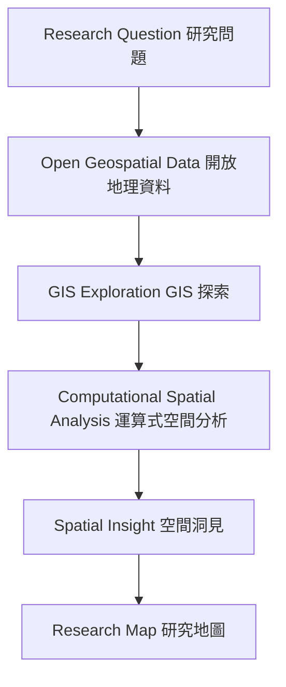
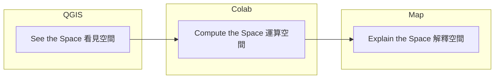
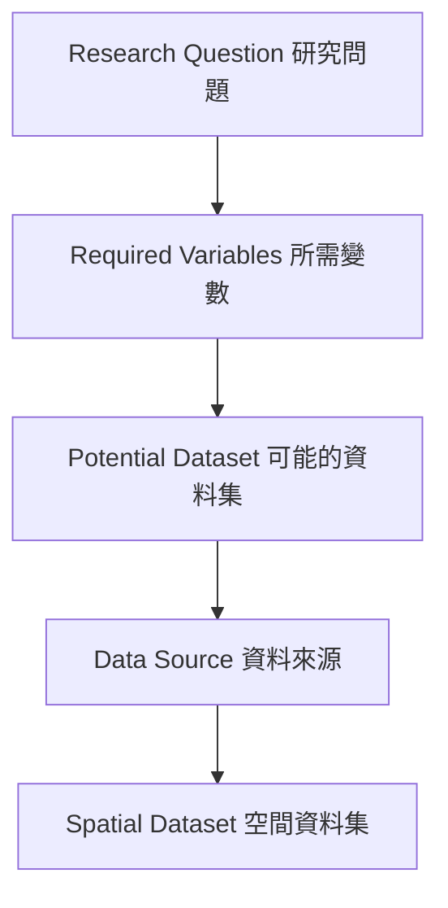

# Mapping the Unknown
### GIS, Open Data & Spatial Analysis
探索未知空間：GIS、開放資料與空間分析

A 2-hour research-oriented workshop for **architecture graduates and early-stage spatial researchers** — no advanced GIS or Python knowledge required.

> **Don't start with a map. Start with a question.**
> 不要從地圖開始。從問題開始。

> **GIS is not only for making maps. GIS is a way to think spatially.**
> GIS 不只是用來畫地圖，而是一種空間思考的方式。

```text
Map the Unknown → Analyze the Space → Discover the Insight
探索未知空間     →   分析空間        →   發現洞見
```

---

## 1. Why this workshop exists 為什麼有這個工作坊

Most GIS tutorials start with software. This one starts with a **research question**, and only reaches for GIS and code when the question demands it.

多數 GIS 教學從軟體操作開始。這個工作坊從**研究問題**出發，只有當問題需要時，才引入 GIS 與程式工具。



This repository works both as:
本專案可作為：

- a **2-hour instructor-led workshop** 教師帶領的 2 小時工作坊
- a **self-learning research toolkit** 自學用的研究工具箱

---

## 2. Learning objectives 學習目標

By the end of this workshop, learners can:
完成工作坊後，學習者將能夠：

1. Explain what GIS is and why it is a research method, not just a mapping tool.
   說明什麼是 GIS，以及為何它是一種研究方法而非僅是製圖工具。
2. Distinguish vector/raster, point/line/polygon, attributes, coordinates, and CRS using architectural examples.
   透過建築案例區分向量／網格、點／線／面、屬性資料、座標與 CRS。
3. Find and evaluate open geospatial data sources (OpenStreetMap, government open data, APIs).
   尋找並評估開放地理資料來源（OpenStreetMap、政府開放資料、API）。
4. Perform essential QGIS operations: load, inspect, filter, buffer, spatial join, intersect, symbolize.
   執行 QGIS 核心操作：載入、檢視、篩選、緩衝區、空間join、交集、基本符號化。
5. Run beginner-friendly Python geospatial analysis in Google Colab with GeoPandas.
   在 Google Colab 中使用 GeoPandas 執行初學者友善的 Python 空間分析。
6. Translate spatial data patterns into a research interpretation (What? Where? Why? So what?).
   將空間資料的樣式轉譯為研究詮釋（是什麼？在哪裡？為什麼？所以呢？）。
7. Design a research map that communicates one spatial insight clearly.
   設計一張能清楚傳達一個空間洞見的研究地圖。

See [`syllabus/learning-objectives.md`](syllabus/learning-objectives.md) for the full breakdown.

---

## 3. 2-hour schedule 兩小時課程時程

| # | Module | Time | Focus |
|---|--------|------|-------|
| 01 | [Mapping the Unknown](lessons/01-mapping-the-unknown/) | 10 min | What is GIS / spatial thinking |
| 02 | [From Space to Data](lessons/02-space-to-data/) | 15 min | Vector, raster, CRS, attributes |
| 03 | [Finding Open Geospatial Data](lessons/03-open-geospatial-data/) | 15 min | OSM, open data, APIs |
| 04 | [QGIS Basics](lessons/04-qgis-basics/) | 20 min | Load → filter → buffer → join → intersect |
| 05 | [Computational GIS with Colab](lessons/05-computational-gis/) | 20 min | GeoPandas, Shapely, Matplotlib |
| 06 | [From Data to Spatial Insight](lessons/06-spatial-insight/) | 15 min | Pattern → relationship → interpretation |
| 07 | [Research Map Design](lessons/07-research-map-design/) | 20 min | Hierarchy, color, typography, annotation |
| 08 | [One Map Challenge](exercises/04_one_map_challenge/) | 5 min | Final deliverable |

Full teaching plan: [`syllabus/teaching-plan.md`](syllabus/teaching-plan.md)

---

## 4. Repository structure 專案結構

```text
mapping-unknown/
├── syllabus/          workshop outline, objectives, teaching plan 課程大綱與教學計畫
├── lessons/            01–07 teaching modules 教學模組
├── notebooks/          Colab-ready Python notebooks Colab 筆記本
├── qgis/                QGIS step-by-step guides QGIS 操作教學
├── data/                 raw / processed sample data 範例資料
├── scripts/            download / preprocessing / analysis helpers 輔助腳本
├── exercises/         hands-on exercises 實作練習
├── examples/         research map examples 範例研究地圖
└── resources/         reference guides (GIS, open data, Python, research methods, map design)
                        參考資源（GIS、開放資料、Python、研究方法、地圖設計）
```

---

## 5. QGIS + Colab: two tools, one workflow QGIS 與 Colab：兩個工具，一條工作流



- **QGIS = See the Space** — explore data visually, build spatial intuition.
  QGIS ＝看見空間 — 用視覺方式探索資料，建立空間直覺。
- **Colab / Python = Compute the Space** — run reproducible, scalable spatial operations.
  Colab／Python ＝運算空間 — 執行可重現、可擴充的空間運算。
- **Research Map = Explain the Space** — communicate the insight to others.
  研究地圖＝解釋空間 — 向他人傳達洞見。

They are not competitors. Use QGIS to *see* what you're working with, then Colab to *compute* it at scale, then design a map to *explain* it.
兩者並非互斥。先用 QGIS「看見」資料，再用 Colab「運算」資料，最後用地圖「解釋」發現。

---

## 6. Open data philosophy 開放資料哲學



Never start by browsing open data portals for "something interesting." Start from your question, derive what variables you need, *then* go looking.
不要一開始就漫無目的瀏覽開放資料平台找「有趣的東西」。先從問題出發，推導出所需變數，再去尋找資料。

See [`resources/open-data/`](resources/open-data/).

---

## 7. How to run the notebooks 如何執行筆記本

All notebooks in [`notebooks/`](notebooks/) run entirely in **Google Colab** — no local install required.

1. Click the **Open in Colab** badge at the top of any notebook.
   點擊筆記本頂端的「Open in Colab」徽章。
2. Run cells top to bottom (`Runtime → Run all`).
   由上而下執行所有儲存格（`Runtime → Run all`）。
3. The first cell installs dependencies (`geopandas`, `shapely`, `matplotlib`) automatically.
   第一個儲存格會自動安裝所需套件。

| Notebook | Open |
|---|---|
| [01_open_data.ipynb](notebooks/01_open_data.ipynb) | [](https://colab.research.google.com/github/andrewwangarchnycu/gis-open-data-workshop-2026/blob/main/notebooks/01_open_data.ipynb) |
| [02_geodata_exploration.ipynb](notebooks/02_geodata_exploration.ipynb) | [](https://colab.research.google.com/github/andrewwangarchnycu/gis-open-data-workshop-2026/blob/main/notebooks/02_geodata_exploration.ipynb) |
| [03_spatial_analysis.ipynb](notebooks/03_spatial_analysis.ipynb) | [](https://colab.research.google.com/github/andrewwangarchnycu/gis-open-data-workshop-2026/blob/main/notebooks/03_spatial_analysis.ipynb) |
| [04_mini_research.ipynb](notebooks/04_mini_research.ipynb) | [](https://colab.research.google.com/github/andrewwangarchnycu/gis-open-data-workshop-2026/blob/main/notebooks/04_mini_research.ipynb) |

Repository: [github.com/andrewwangarchnycu/gis-open-data-workshop-2026](https://github.com/andrewwangarchnycu/gis-open-data-workshop-2026)

---

## 8. The One Map Challenge 一張地圖挑戰

Every learner produces, in one final graphic:
每位學習者最終產出一張圖，包含：

```text
1 Research Question   一個研究問題
+ 1 Spatial Analysis  一次空間分析
+ 1 Research Map      一張研究地圖
+ 1 Spatial Insight   一個空間洞見
```

Example question: **"Where are the greener public spaces?"** 範例問題：**「哪裡是較綠意盎然的公共空間？」**

See [`exercises/04_one_map_challenge/`](exercises/04_one_map_challenge/).

---

## 9. Research map design principles 研究地圖設計原則

A research map is evidence for an argument, not decoration. It should look like an **analytical diagram**, not a raw GIS screenshot.
研究地圖是論證的證據，不是裝飾。它應該看起來像一張**分析圖表**，而不是 GIS 軟體的原始截圖。

Core topics — see [`resources/map-design/`](resources/map-design/):

- [Visual hierarchy 視覺層級](resources/map-design/visual-hierarchy.md)
- [Figure-ground 圖底關係](resources/map-design/figure-ground.md)
- [Color for maps 地圖用色](resources/map-design/color-for-maps.md)
- [Typography 字體排印](resources/map-design/typography.md)
- [Annotation 標註](resources/map-design/annotation.md)
- [Legend design 圖例設計](resources/map-design/legend-design.md)
- [Research map checklist 研究地圖檢查清單](resources/map-design/research-map-checklist.md)

---

## 10. Research case: flexible urban/public-space layers 研究案例：彈性的都市／公共空間圖層

This workshop is **not** hard-coded around any single topic (e.g. thermal comfort). It uses a flexible set of urban/environmental layers — building footprints, trees, green spaces, roads, public spaces, land use, elevation — that transfer to many research directions:
本工作坊**不**綁定單一主題（例如熱舒適度）。它使用一組彈性的都市／環境圖層 — 建築足跡、樹木、綠地、道路、公共空間、土地利用、高程 — 可延伸至多種研究方向：

- Urban morphology 都市型態
- Mobility 移動性
- Walkability 步行友善度
- Landscape 地景
- Environmental analysis 環境分析
- Public space 公共空間
- Spatial behavior 空間行為

---

## 11. Repository quality standard 專案品質標準

This repository prioritizes, in order:
本專案的優先順序：

1. Research thinking 研究思維
2. Spatial reasoning 空間推理
3. Data literacy 資料素養
4. Reproducibility 可重現性
5. Visual communication 視覺傳達
6. Technical implementation 技術實作

It should feel like **Architecture + GIS + Computational Research + Information Design** — not a generic programming tutorial.
它應該讀起來像**建築 + GIS + 運算研究 + 資訊設計**的結合，而不是一份通用的程式教學。

---

## License 授權

See [`LICENSE`](LICENSE). Contributions welcome — see [`CONTRIBUTING.md`](CONTRIBUTING.md).
